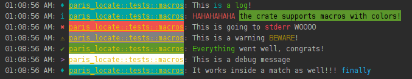

本库实现了在paris打印日志的过程中定位使用该宏的函数名称

1. 采用了paris进行log输出与彩色显示
2. 使用std-ext::function_name获取函数名称 
3. 采用https://github.com/sindresorhus/figures 中的特殊符号为每一个宏配置了对应符号

| level    | symbol |
|:---------|--------|
| log      | ♦      |
| info     | i      |
| debug    | >      |
| warning  | ⚠      |
| error    | ✖      |
| success  | ✔      |

输出范例如下：

   

